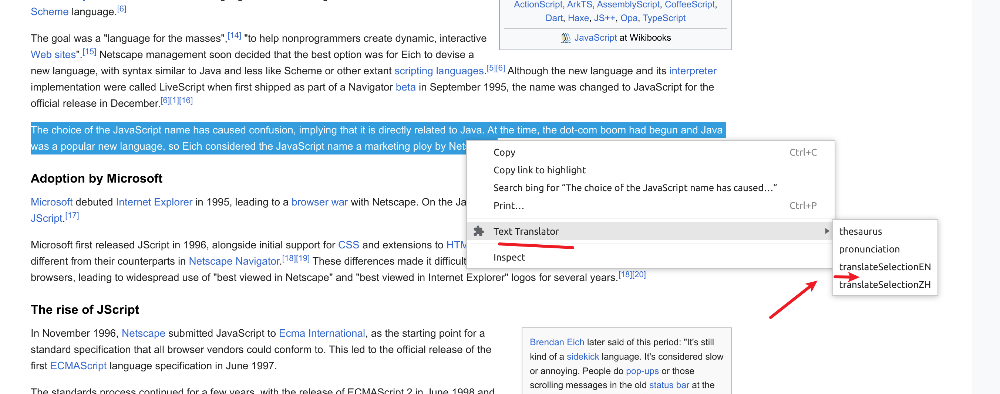
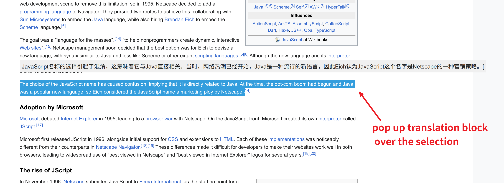
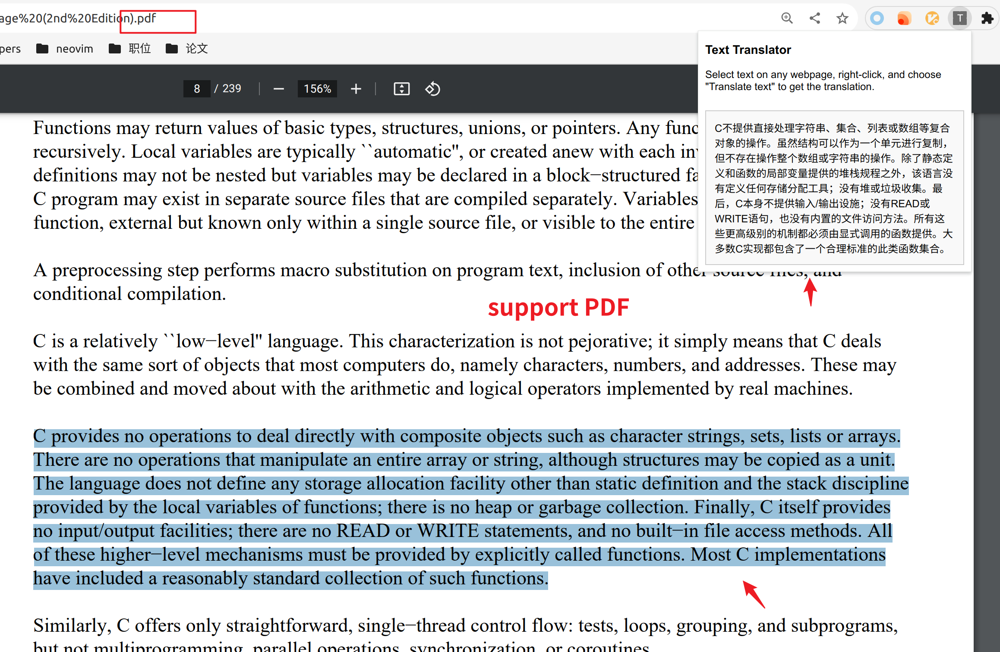

# INTRODUCTION

 a chrome plugin to translate, **no advertisement**

 # USAGE

  1. select a piece of text with mouse, then right click,  select an option from the menu
 
  2.  pop  up  a  translation block over the selection , then fade out in 5 seconds
  
  3. support PDF reading on chrome
 

# PREREQUISITES
 * Python3
 * Redis
 * Flask

# INSTALL

  ## 1. chrome-plugin install 
please see  [Reference](https://sspai.com/post/52767)
  ## 2. Web backend setup

  1. install redis, on Ubuntu
      ```
      sudo apt install redis
      ```

  2. download english thesaurus, and cache thesaurus to redis 
     
     ```
     git clone git@github.com:zaibacu/thesaurus.git thesaurus
     # upload to reids 
     python3 upload_english_words_to_redis.py
     ```
  3.  change your  baidu api information, vim  `flask-backend/chrome-backend.py`

      ```python
        def translateBaidu(q, from1, to):
            # replace the following variable with your own information
            appid = "xxxxx"
            salt = "xxx"
            passwd = "xxxx"
      ```
      see more [baidu fanyi api documentation](https://api.fanyi.baidu.com/product/113)

  4. set up flask 
     ```
     pip3 install pyttsx3
     pip3 install flask
     pip3 install flask-cores
     pip3 install inflect
     cd flask-background
     flask --app chrome-backend.py run
     ```
